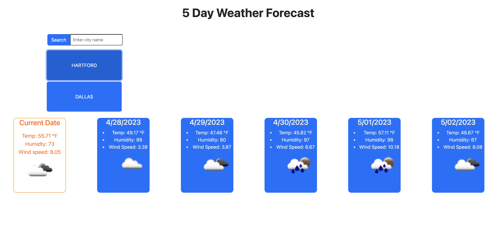
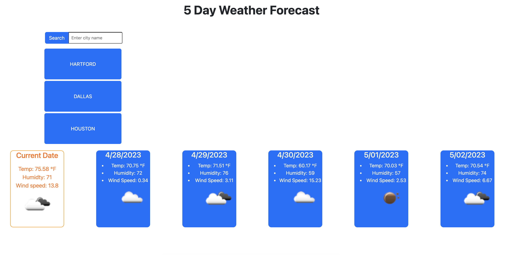

# 06 Server-Side APIs: Weather Dashboard

This application is a 5 day weather forecasting application using the server side API from OpenWeatherMaps.
This application is made from using an API key to fetch data from OpenWeatherMaps and populate it into a page dependant on city searches using latitude and longitude information.

A user can input a city name and press the search button, and the current weather and 5 day forecast ahead will generate on the page, along with humidity and wind speed. 

The search will save in local storage and populate as a button that can be clicked to re-fetch that same information. 

Here is a screenshot of the application.

Here is a link to the deployed application:
https://carsonadair.github.io/challeng-6-weather-app/